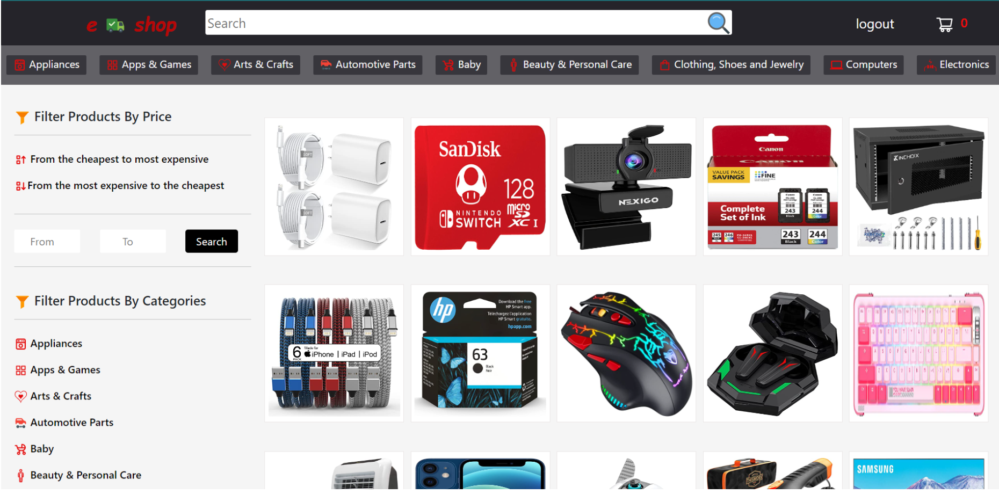

<p align="center">
  <a href="" rel="noopener">
 </a>
</p>

<h3 align="center">E Shop</h3>

---

<p align="center"> E-Commerce WebApp 
    <br> 
<!-- <a href=''>Demo</a> -->
    <br> 
</p>

## 📝 Table of Contents

- [About](#about)
- [Getting Started](#getting_started)
- [Usage](#usage)
- [Built Using](#built_using)
- [User Story](#user_story)
- [Data Flow](#data_flow)
- [Guided By](#guided_by)

## 🧐 About <a name = "about"></a>

> Users on **[ e shop ]** site can interact with each other to purchase items. The **owner or admin** of the site can display his products to users, delete them and modify them, so that users can buy these products, and users can search products within the site either by categories or according to the price of the product or the name of the product, and they can add these products to the cart.

> After adding their products to the shopping cart, users can complete the payment by paying upon receipt or by bank card.

## 🏁 Getting Started <a name = "getting_started"></a>

These instructions will get you a copy of the project up and running on your local machine for development and testing purposes.

### Prerequisites

- Visual Studio Code follow this <a href='https://visualstudio.microsoft.com/'>link</a> to install.
- Git Bash follow this <a href='https://gitforwindows.org/'>link</a> to install.
- MongoDB follow this <a href='https://www.mongodb.com/'>link</a> to install.
- Node.js follow this <a href='https://nodejs.org/en/'>link</a> to install.

### Installing:

Here is step by step series of examples that tell you how to get a development env running.

Main folder that contains two files **BackEnd** and **FrontEnd**.

1. Open code
```
$ code.
```

2. Install packeges repeat this step in backend and frontend folder

```
npm i
```
```
npm i axios
```
```
npm i becrypt
```
```
npm i jsonwebtoken
```
```
npm i mongoose
```
```
npm i express
```
```
npm i nodemon
```

3. Run server using git bash inside backend folder

```
npm run dev
```

4. Run application using git bash inside frontend folder

```
npm run start
```

Now app ready to use

## 🎈 Usage <a name="usage"></a>

- On the main page the items are displayed.

- On the left of the screen, you can search for the product by price, ascending or descending, or by product category. Click the Register button to create a new account.

- On the main page, you can check item details, add to cart, exchange , and a back button that will take you a step back.

- After adding the items to the cart, you can click the cart icon at the top right of the screen to access the cart that checks all the items that have been added, change the quantity of the desired item, or you can remove it from the shopping cart, at the bottom you can check the total of all Items and behinde them there is a button to buy .

- The admin part, when you log in via the admin settings will appear at the top right of the screen, in the settings dropdown menu you can: Create a product and view and edit existing products
  And delete them and record the products sold and suspended products and also he can control the accounts by deleting them for example, the logout button to log out.

## ⛏️ Built Using <a name = "built_using"></a>

- [MongoDB](https://www.mongodb.com/) - Database
- [Express JS](https://expressjs.com/) - Server Framework
- [React JS](https://https://reactjs.org/) - Web Framework
- [Node JS](https://nodejs.org/en/) - Server Environment

## User Story <a name = "#user_story"></a>

Your trello board link
<a href=''>Trello</a>

## Data Flow <a name = "#data_flow"></a>

</a>

## ⚠️ Guided By <a name = "guided_by"></a>

This project is guided by ©️ **[MERAKI Academy](https://www.meraki-academy.org)**
